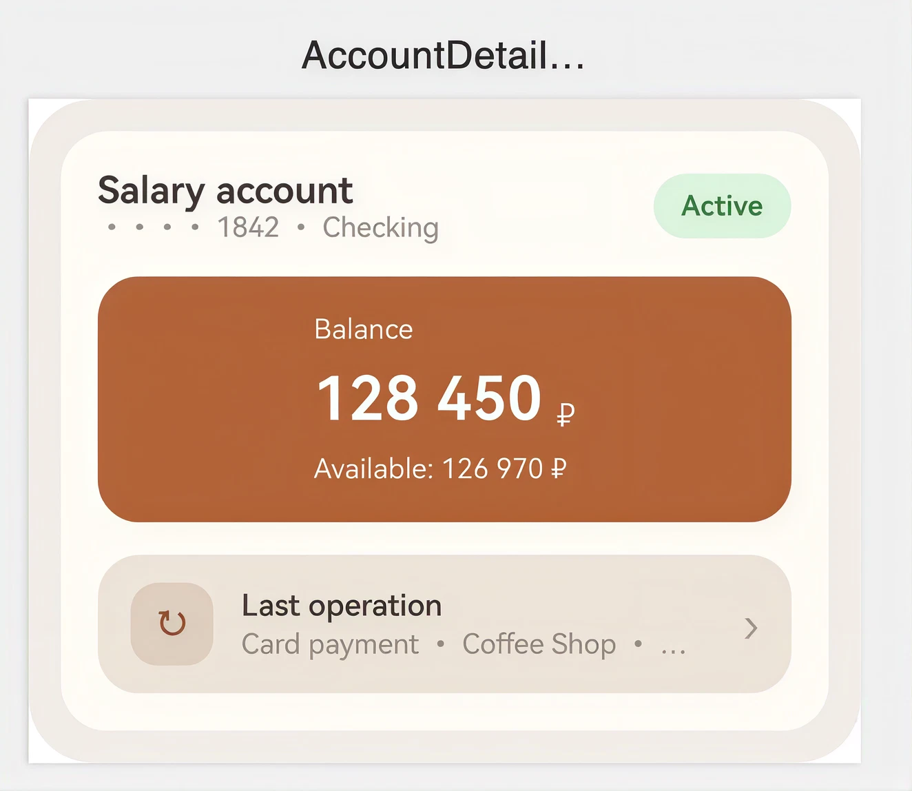

# MOBIUS 2026 Autumn — Migrating Android to HarmonyOS NEXT

Демо-компоненты к докладу «Портирование Android-приложений в HarmonyOS NEXT с
использованием формальных спецификаций» (Mobius 2026 Autumn, Иван Миленин,
Липтсофт + ИТМО).

Каждая папка — один UI-компонент, реализованный дважды: на **Jetpack Compose**
(Android) и на **ArkUI** (HarmonyOS NEXT). ArkUI-версия — не иллюстрация, а
реальный вывод `android-harmony-transpiler` (`TerminalApplicationKt`) для
соответствующего Compose-кода, как есть, без ручной правки.

## Компоненты

<table>
<tr>
<th align="center" width="25%">Employee Card</th>
<th align="center" width="25%">Bank Profile Header</th>
<th align="center" width="25%">Confirm Transaction</th>
<th align="center" width="25%">Quiz</th>
</tr>
<tr>
<td><a href="employee-card"></a></td>
<td><a href="bank-profile-header"></a></td>
<td><a href="confirm-transaction"></a></td>
<td><a href="quiz"></a></td>
</tr>
<tr>
<td align="center"><a href="employee-card">employee-card</a></td>
<td align="center"><a href="bank-profile-header">bank-profile-header</a></td>
<td align="center"><a href="confirm-transaction">confirm-transaction</a></td>
<td align="center"><a href="quiz">quiz</a></td>
</tr>
</table>

🔥 [Презентация доклада](presentation-portirovanie-android-prilozhenii-v-ekosistemu-harmonyos-next_4k.pdf)

| Папка | Компонент |
|---|---|
| [`employee-card`](employee-card) | Карточка сотрудника |
| [`bank-profile-header`](bank-profile-header) | Карточка банковского счёта |
| [`confirm-transaction`](confirm-transaction) | Экран подтверждения перевода |
| [`quiz`](quiz) | Вопрос-квиз с вариантами ответов |

## Структура папки компонента

```
<component>/
├── README.md         — описание + скриншоты Android / HarmonyOS
├── compose/           — реализация на Jetpack Compose
├── arkui/              — вывод транспайлера на ArkUI
└── screenshots/       — android.png, arkui.png
```
