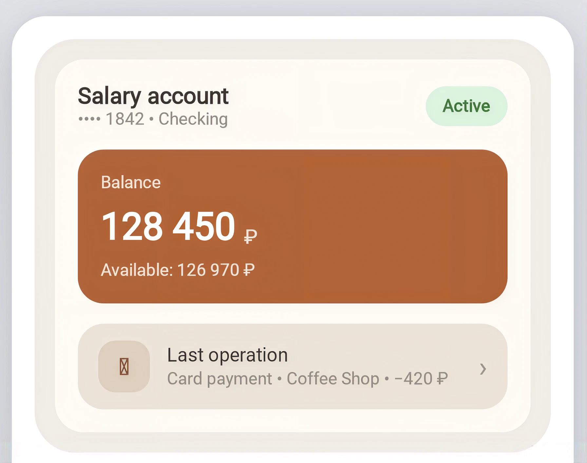

# Bank Profile Header

Карточка счёта: название и маскированный номер, бейдж статуса, блок баланса
с акцентным фоном (валюта + доступный остаток) и строка последней операции
с иконкой, заголовком/подзаголовком и шевроном.

> Реальный вывод `android-harmony-transpiler` (`TerminalApplicationKt`) —
> `arkui/AccountDetailsTile.ets` сгенерирован из
> `compose/AccountDetailsTile.kt` транспайлером как есть, без ручной правки.

## Скриншоты

<table>
<tr>
<th align="center">Android · Jetpack Compose</th>
<th align="center">HarmonyOS NEXT · ArkUI</th>
</tr>
<tr>
<td></td>
<td></td>
</tr>
</table>

## Код

| Платформа | Файл |
|---|---|
| Android (Jetpack Compose) | [`compose/AccountDetailsTile.kt`](compose/AccountDetailsTile.kt) |
| HarmonyOS NEXT (ArkUI) | [`arkui/AccountDetailsTile.ets`](arkui/AccountDetailsTile.ets) |

## Соответствие концепций

| Compose | ArkUI |
|---|---|
| `Box(modifier = ...)` | `Stack() { ... }` |
| `Modifier.clip(RoundedCornerShape(N.dp))` | `.borderRadius(N).clip(true)` |
| `Column(verticalArrangement = Arrangement.spacedBy(N.dp))` | `Column({ space: N })` |
| `Modifier.weight(1f)` | `.layoutWeight(1)` |
| `Box(contentAlignment = Alignment.Center)` | `Stack({ alignContent: Alignment.Center })` |
| `maxLines = 1, overflow = TextOverflow.Ellipsis` | `.maxLines(1).textOverflow({ overflow: TextOverflow.Ellipsis })` |
| Kotlin string template `"Available: $available $currency"` | JS template-строка `` `Available: ${this.available} ${this.currency}` `` |
| именованные `Color`-параметры (`statusBg`, `statusFg`) | `ResourceColor`-параметры, прокидываются как есть |
