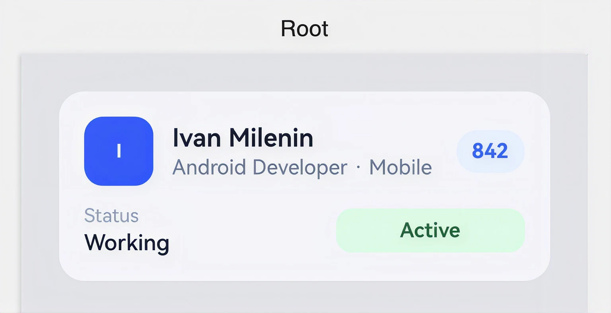

# Employee Card

Карточка сотрудника: вложенная подложка (внешний фон + внутренняя карточка),
аватар-инициал, имя с бейджем счёта, должность и строка статуса с пилюлей
«Active».

> Реальный вывод `android-harmony-transpiler` (`TerminalApplicationKt`) —
> `arkui/EmployeeCard.ets` сгенерирован из `compose/EmployeeCard.kt`
> транспайлером как есть, без ручной правки.

## Скриншоты

<table>
<tr>
<th align="center">Android · Jetpack Compose</th>
<th align="center">HarmonyOS NEXT · ArkUI</th>
</tr>
<tr>
<td></td>
<td></td>
</tr>
</table>

## Код

| Платформа | Файл |
|---|---|
| Android (Jetpack Compose) | [`compose/EmployeeCard.kt`](compose/EmployeeCard.kt) |
| HarmonyOS NEXT (ArkUI) | [`arkui/EmployeeCard.ets`](arkui/EmployeeCard.ets) |

## Соответствие концепций

| Compose | ArkUI |
|---|---|
| `@Composable fun EmployeeCard(...)` | `@ComponentV2 struct EmployeeCard { build() { ... } }` |
| `Box(modifier = ...)` | `Stack() { ... }` |
| `Spacer(Modifier.width(12.dp))` / `.height(2.dp)` | `Blank().width(12)` / `Blank().height(2)` |
| `Spacer(Modifier.weight(1f))` | `Blank().layoutWeight(1)` |
| `Modifier.weight(1f)` на `Column`/`Row` | `.layoutWeight(1)` цепочкой после элемента |
| `name.firstOrNull()?.uppercase() ?: "?"` | `this.name.charAt(0)?.toUpperCase() ?? "?"` |
| `Box(contentAlignment = Alignment.Center)` | `Stack({ alignContent: Alignment.Center })` |
| `fun Root()` (превью-обёртка) | `@ComponentV2 @Preview struct Root` |
