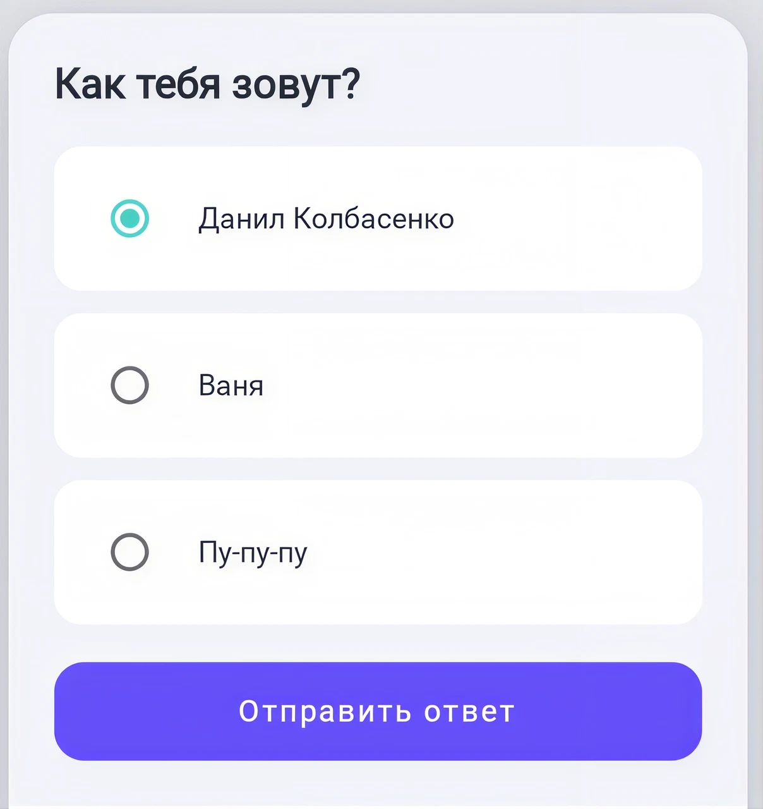
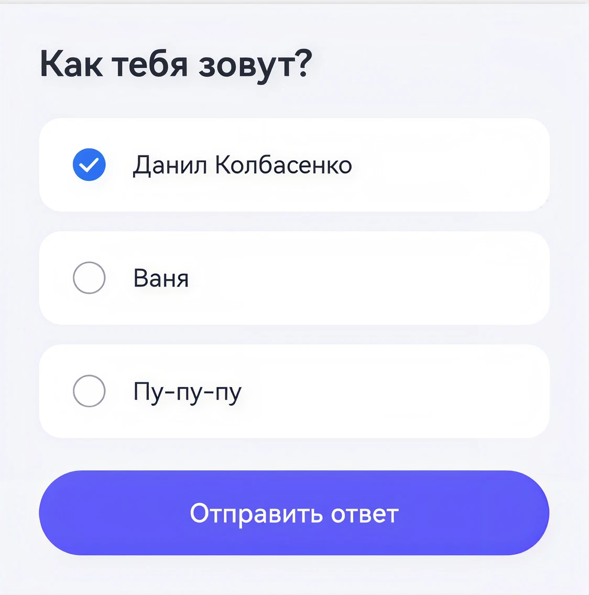

# Quiz Question

Вопрос-квиз «Как тебя зовут?»: заголовок, список вариантов ответа
(`AnswerItem` — радиокнопка + текст, выбранный вариант подсвечивается) и
кнопка отправки, активная только при выбранном ответе.

> Реальный вывод `android-harmony-transpiler` (`TerminalApplicationKt`) —
> `arkui/NameQuestionScreen.ets` сгенерирован из
> `compose/NameQuestionScreen.kt` транспайлером как есть, без ручной правки.

## Скриншоты

<table>
<tr>
<th align="center">Android · Jetpack Compose</th>
<th align="center">HarmonyOS NEXT · ArkUI</th>
</tr>
<tr>
<td></td>
<td></td>
</tr>
</table>

## Код

| Платформа | Файл |
|---|---|
| Android (Jetpack Compose) | [`compose/NameQuestionScreen.kt`](compose/NameQuestionScreen.kt) |
| HarmonyOS NEXT (ArkUI) | [`arkui/NameQuestionScreen.ets`](arkui/NameQuestionScreen.ets) |

## Соответствие концепций

| Compose | ArkUI |
|---|---|
| `@Composable fun NameQuestionScreen(...)` | `@ComponentV2 struct NameQuestionScreen { build() { ... } }` |
| `Column(verticalArrangement = Arrangement.spacedBy(20.dp))` | `Column({ space: 20 })` — числовой отступ извлекается напрямую из `spacedBy(...)`, а не через `Arrangement`/`FlexAlign` |
| `Row(verticalAlignment = Alignment.CenterVertically)` | `.alignItems(VerticalAlign.Center)` |
| `Modifier.clickable(onClick = click)` | `.onClick(this.click)` |
| `ButtonDefaults.buttonColors(backgroundColor = ..., contentColor = ...)` | `new ButtonColors(...).backgroundColor` / `.contentColor` — сгенерированный класс `ButtonColors` эмитится в том же файле |
| `enabled = selectedAnswer != null` | `.enabled(this.selectedAnswer != null)` |
| `RadioButton(selected = ..., onClick = ...)` | `Radio({ group: '', value: '' }).checked(...).onClick(...)` |
